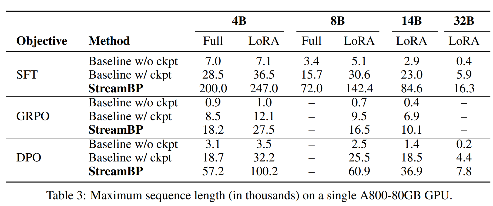
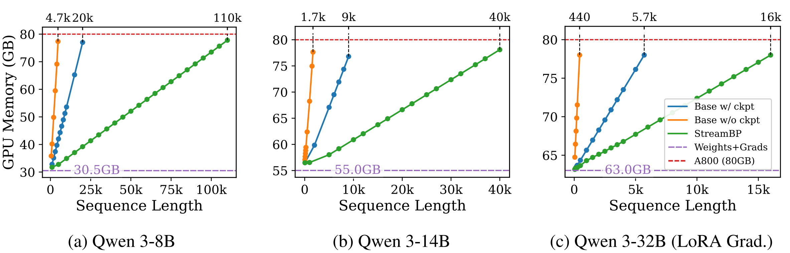

<!-- 
**Maximum sequence length in a single A800-80GB GPU** -->


<!-- **Peak Backpropagation memory cost** -->

# StreamBP
Code for [StreamBP: Memory-Efficient Exact Backpropagation for Long Sequence Training of LLMs](https://arxiv.org/abs/2506.03077).

StreamBP substantially reduces the memory cost of activation values and scales up the maximum sequence length by 2.8-5.5 $\times$ larger than gradient checkpointing, while using similar or even less BP time.

> [!NOTE]
> This codebase is under active development; feel free to raise any issues you encountered. We are also accepting feature requests.


### Table of Contents
- [Features](#features)
- [Setup](#setup)
- [Reproduce StreamBP](#reproduce-streambp)
- [Usage](#use-streambp-in-your-own-training-pipeline)
- [Todo List](#todo-list)

### Features
* **Verified model classes**: Qwen-2.5/3, Llama-3/3.1/3.2, Gemma3.
* **Various objectives**: SFT, GRPO, DPO.
* **Distributed training support**: Deepspeed ZeRO stage 1 & 2.
> [!NOTE]
> The code is applicable to general transformer model classes and is not restricted to the aforementioned model classes. However, due to different architecture design (e.g. normalization), the current implementation may induce incorrect gradient computation. We are actively testing and incoporating different model classes.

### Setup
Setup the environment from source by the following commands:
```bash
conda create -n streambp python=3.10
conda activate streambp

git clone https://github.com/Ledzy/StreamBP.git
cd StreamBP
pip install -e .
pip install -r requirements.txt
```
> [!NOTE]
> The gradient calculation of other `transformer` and `trl` versions may be different and leads to incorrect result. We are actively developing the repository and will release a more stable implementation later.

### Reproduce StreamBP
Paper results can be reproduced by the scripts under `scripts` folder.

<details><summary>Click to see example commands</summary>

<!-- Follow the following commands to reproduce the paper's result in BP and maximum sequence length. -->
**Example commands for BP, SFT, DPO, and GRPO**
```bash
export CUDA_VISIBLE_DEVICES=0

#Test BP's memory and time cost
python scripts/test_bp.py --mode stream --seq_len 15000 --chunk_size 5000 --model_name Qwen/Qwen3-8B # StreamBP
python scripts/test_bp.py --mode base --seq_len 15000 --model_name Qwen/Qwen3-8B # Gradient checkpointing

#Test SFT's memory and time cost
python scripts/test_sft.py --mode stream --seq_len 15000 --chunk_size 5000 --model_name Qwen/Qwen3-8B # StreamBP
python scripts/test_sft.py --mode base --seq_len 15000 --model_name Qwen/Qwen3-8B # Gradient checkpointing

#Test DPO's memory and time cost
python scripts/test_dpo.py --mode stream --seq_len 15000 --chunk_size 5000 --model_name Qwen/Qwen3-8B # StreamBP
python scripts/test_dpo.py --mode base --seq_len 15000 --model_name Qwen/Qwen3-8B # Gradient checkpointing

#Test GRPO's memory and time cost
python scripts/test_grpo.py --mode stream --seq_len 15000 --chunk_size 5000 --model_name Qwen/Qwen3-8B # StreamBP
python scripts/test_grpo.py --mode base --seq_len 15000 --model_name Qwen/Qwen3-8B # Gradient checkpointing
```
**Note:** The above experiments should be run on a single GPU (i.e. `export CUDA_VISIBLE_DEVICES=0`). Otherwise, one may encounter unexpected errors.

**Example command for ZeRO-2:**
```bash
export CUDA_VISIBLE_DEVICES=0,1,2,3
deepspeed scripts/test_zero.py --mode stream --seq_len 30000 --zero_stage 2 --model_name Qwen/Qwen3-8B # StreamBP
deepspeed scripts/test_zero.py --mode stream --seq_len 30000 --zero_stage 2 --model_name Qwen/Qwen3-8B # Gradient checkpointing
```
</details>

### Use StreamBP in your own training pipeline
Use StreamBP in your own project involves two simple modifications on your original codebase.

**Step 1: Modification of Trainer.** If you are using TRL's default Trainer of SFT/DPO/GRPO, replace the trainer with `streambp.StreamSFTTrainer`, `streambp.StreamDPOTrainer`, and `StreamGRPOTrainer`, respectively.

If you are using a customized Trainer with SFT objective, add `self.accelerator.backward = lambda loss: None` at the end of Trainer's `__init__` function as following:
```python
class YourTrainerClass(...):
    def __init__(
        self, *args, **kwargs
    ) -> None:
        super().__init__(**kwargs)
        ... # other code
        self.accelerator.backward = lambda loss: None # backward is fused with forward, no need to call accelerator.backward
```

**Step 2: Wrap model.** Wrap your model as follows:

```python
from streambp import StreamModel # NOTE: For Gemma3 models, use StreamModelForGemma

# wrap your model with StreamModel
model = StreamModel(
    model=model,
    logits_chunk_size=100, # Partition size of logits
    stream_checkpoint=True, # If it's False, only the logits will be partitioned
    checkpoint_chunk_size=2000, # Suggested value: sequence_len/3
    gradient_accumulation_steps=1 # Set this to match your trainer's args
    )

# other parts remain unchanged
trainer = YourTrainerClass(
    model=model,
    ...
)
...
```

### Todo List
- [ ] Support ZeRO-3 training
- [ ] Support PPO
- [ ] Support Verl's RL algorithms